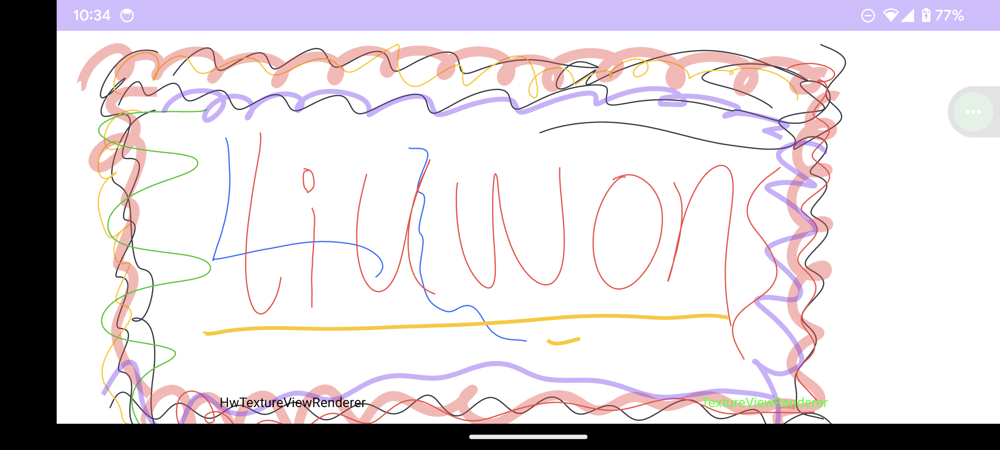

# HwTextureView
Android TextureView with hardware acceleration


## Usage

``` kotlin
implementation("io.github.liuwons:hwtextureview:1.0.2")
```

Get **Canvas** by `HwTextureView.lockCanvas()` and draw !

## Performance Test


|      | TextureView | HwTextureView |
| ---- | ----------- | ------------- |
| frame render time | 10ms        | 1ms           |
| CPU  | 13ms        | 8ms           |


Test project: [TextureViewPlayground](https://github.com/liuwons/TextureViewPlayground)

Render content: 30 stroked path


